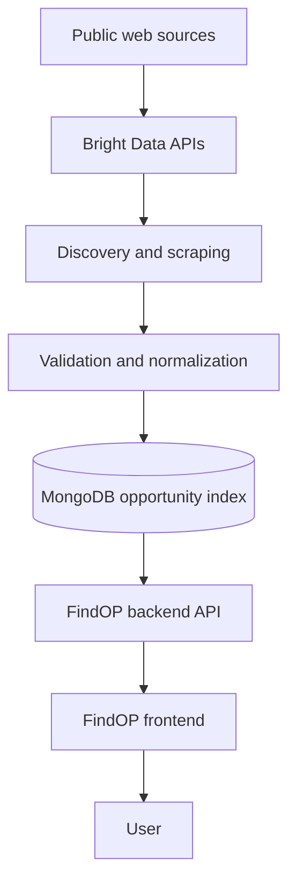
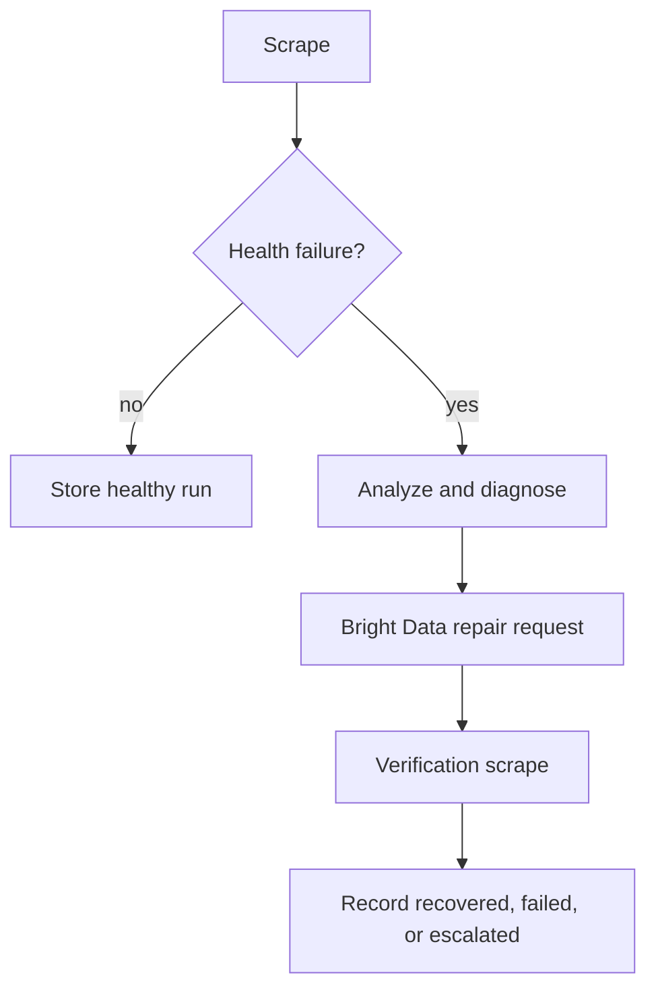

# FindOP architecture

FindOP has a React/TypeScript frontend, an Express/TypeScript backend, and a
MongoDB persistence layer. The backend coordinates discovery, Bright Data
requests, ingestion, validation, normalization, health analysis, and healing.

## Self-healing flow

The backend records scrape quality and execution health. When a configured,
healable failure is detected, it diagnoses the failure, requests a Bright Data
collector repair, polls the repair status, runs a verification scrape, and
records the recovered, failed, or escalated result.

Healing is disabled by default and may require provider approval, depending on
the Bright Data response.
